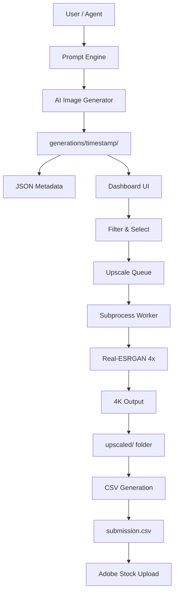
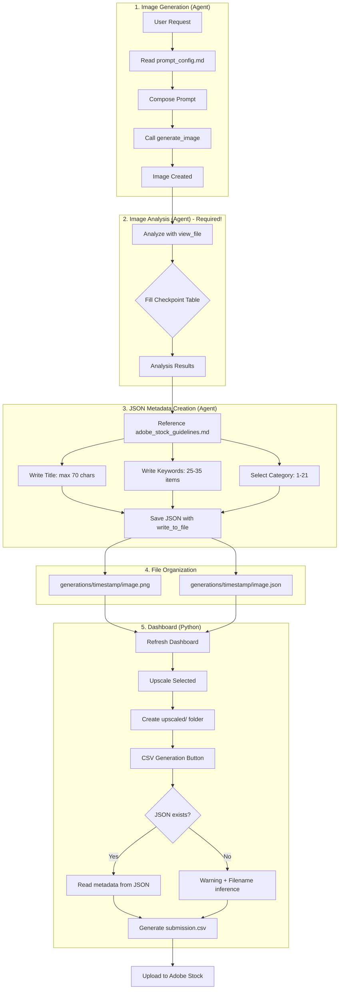

# Adobe Stock Generator

AI-powered image generation pipeline for Adobe Stock submissions with drag-and-drop dashboard management.

> ℹ️ **Note:** This project is designed to operate as a core module within the **Google Antigravity** agentic workflow, enabling seamless automation from prompt generation to final submission.

## 🎯 Overview

This project automates the Adobe Stock image submission workflow:
1. **Generate Prompts** → Create optimized prompts for AI image generation
2. **Process Images** → Crop to 16:9 and upscale to 4K with Real-ESRGAN
3. **Review & Select** → Drag-and-drop dashboard for image curation
4. **Submit** → Generate Adobe Stock compliant CSV metadata

---

## 📁 Project Structure

```
adobe-stock-generator/
├── dashboard/
│   ├── app.py                  # Flask web dashboard & API
│   └── templates/
│       └── index.html          # Drag-and-drop dashboard UI
├── config/
│   ├── prompt_config.md        # 📝 Editable prompt configuration
│   ├── strategy_guide.md       # 📊 Power law strategy guide
│   └── adobe_stock_guidelines.md # 📚 Metadata best practices & rules
├── visual_schema.py            # Visual attribute enums
├── prompt_engine.py            # Prompt construction logic
├── generate_prompts.py         # Prompt generation script
├── generation_pipeline.py      # Image processing (crop + upscale)
├── metadata_generator.py       # Adobe Stock metadata generator
├── models.py                   # Real-ESRGAN model definitions
├── weights/                    # Model weights (auto-downloaded)
├── generations/                # Output folder (timestamped)
│   └── {timestamp}/
│       ├── *.png               # Raw generated images
│       ├── *.json              # JSON metadata (sidecar)
│       ├── processed/          # 16:9 cropped images
│       └── upscaled/           # 4K images + submission.csv
├── submissions/                # (Legacy) Old submission packages
├── trash/                      # Deleted images
├── logs/                       # Processing logs
└── start_dashboard.bat         # Windows launcher
```

---

## 🚀 Quick Start

### 1. Generate Prompts
```bash
python generate_prompts.py
```
Creates `generations/{timestamp}/` folder with prompts.

### 2. Add Images
Copy AI-generated images to the `generations/{timestamp}/` folder.

### 3. Launch Dashboard
```bash
start_dashboard.bat
# or
cd dashboard && python app.py
```
Opens http://127.0.0.1:5001

### 4. Dashboard Workflow

| Action | Method |
|--------|--------|
| **Filter Images** | Use filter dropdown: All / Raw / Processed / Upscaled |
| **Select for Upscale** | Drag image → Right panel (Selection) |
| **Delete Image** | Drag image → Left panel (Trash) |
| **Upscale Selected** | Click "⚡ Upscale Selected" |
| **Generate CSV** | Select upscaled images → Click "📦 Create CSV" |
| **Upload to Adobe** | Open `upscaled/` folder → Upload `submission.csv` + images |

---

## 🎨 Prompt Configuration

Edit `config/prompt_config.md` to customize prompts. Changes are reflected automatically.

### Configurable Elements:
- **Trends**: Cyberpunk, Minimalist Zen, Fantastic Frontiers, etc.
- **Styles**: Photorealistic, 3D Render, Cinematic, etc.
- **Lighting**: Natural, Neon, Golden Hour, etc.
- **Composition**: Rule of Thirds, Symmetrical, etc.
- **Color Palettes**: Vibrant Neon, Pastel, Earth Tones, etc.
- **Negative Prompts**: IP avoidance, quality control, content policy

---

## 📊 Core Modules

| Module | Purpose |
|--------|---------|
| `visual_schema.py` | Defines visual attributes (Trend, Style, Lighting, etc.) |
| `prompt_engine.py` | Constructs detailed prompts from attributes |
| `generate_prompts.py` | Generates sample prompts with MECE coverage |
| `generation_pipeline.py` | Image processing (16:9 crop → 4x upscale) |
| `metadata_generator.py` | Adobe Stock compliant metadata & CSV |
| `dashboard/app.py` | Flask API for image management |

---

## 🏗️ System Architecture



---

## 🔧 Key Technical Decisions & Optimizations

This project implements several advanced patterns to ensure stability and performance in a resource-intensive AI pipeline.

### 1. Process Isolation for Stability (Crash Resilience)
- **Challenge:** Upscaling 4K images consumes significant VRAM. If an OOM (Out of Memory) error occurs in a thread, it crashes the entire Flask web server.
- **Solution:** Integrated a **Subprocess Architecture**. The upscaling pipeline runs in a completely isolated process (`subprocess.Popen`).
- **Benefit:** If the GPU worker crashes, the dashboard remains alive, catches the exit code, and reports the error without downtime.

### 2. Memory Leak Prevention
- **Challenge:** PyTorch models and CUDA buffers often linger in VRAM, causing progressive memory buildup when processing batches of images.
- **Solution:** Implemented a **"Load-Execute-Unload"** pattern per image:
  - Explicitly `del` model and image tensors after each iteration.
  - Force `gc.collect()` and `torch.cuda.empty_cache()` to reclaim memory.
  - Reduced Real-ESRGAN tile size to **384px** to balance VRAM usage (6GB safe zone) vs. inference speed.

### 3. Real-time Log Streaming & Deadlock Prevention
- **Challenge:** Python's stdout buffering caused log delays, and unread pipes led to process deadlocks.
- **Solution:** 
  - Forced `sys.stdout.reconfigure(encoding='utf-8')` and `flush=True` in the worker.
  - Implemented a non-blocking pipe reader in the dashboard to drain stdout in real-time.
  - Dashboard UI polls an aggregated log system for live feedback.

### 4. Compatibility Patches
- **Challenge:** `basicsr` library (dependency of Real-ESRGAN) is incompatible with newer `torchvision` versions due to removed modules.
- **Solution:** Injected a runtime **Monkey Patch** to polyfill `torchvision.transforms.functional_tensor`, ensuring compatibility with the latest PyTorch ecosystem without downgrading packages.

---

## 📊 Logging & Debugging

Log files are stored in the `logs/` folder for troubleshooting and performance analysis.

### Log Files:

| File | Purpose |
|------|---------|
| `logs/upscale.log` | Upscaling progress and timing |
| `logs/error.log` | Error stack traces and crash analysis |

### When to Check Logs:

1. **Upscaling failure**: Check `error.log` for root cause
2. **Slow performance**: Check `upscale.log` for per-image timing
3. **Memory issues**: Determine if tile size adjustment is needed

### Performance Tuning:

Adjust `TILE_SIZE` constant in `generation_pipeline.py`:
```python
# 512: Fast, high VRAM usage (8GB+ required)
# 384: Balanced, medium VRAM (~6GB)
# 256: Slow (~50% increase), low VRAM (~4GB) - Safe Mode (Default)
TILE_SIZE = 256
```

### Clearing Logs:
- Use "Clear Logs" button in dashboard UI
- Or manually delete `logs/upscale.log`, `logs/error.log`

---

## 🛠️ Requirements

```
Python 3.10+
Flask
Pillow
OpenCV (cv2)
PyTorch
realesrgan
```

### Install:
```bash
pip install flask pillow opencv-python torch realesrgan
```

---

## 📝 Changelog

- **v1.9**: Critical Memory Optimization
  - 🚀 **FP16 Enabled**: Reduced VRAM usage by ~50% by enabling half-precision in Real-ESRGAN
  - ⚙️ **Tile Size 256**: Reduced default tile size for maximum stability on 6GB VRAM GPUs
  - ✅ **OOM Fix**: Fixed `ArrayMemoryError` during 4K upscaling
- **v1.85**: Category Mapping & UI Fix
  - 🔧 Category mapping fix: Fix category ID errors in `adobe_stock_guidelines.md` (21 full categories)
  - 🎯 Category selection guide: Add correct category mapping guidelines by image type
  - 🐛 Select All bug fix: Only select visible filtered images
- **v1.84**: Power Law Strategy Integration
  - 📊 Strategy guide: Add `config/strategy_guide.md` (power law based Adobe Stock strategy)
  - 🎯 Barbell strategy: Evergreen 60% / Seasonal 30% / Trending 10% portfolio allocation
  - 📅 Season calendar: Upload timing guide (2-3 months ahead)
  - 🔗 Workflow integration: Add strategy guide reference
- **v1.83**: Workflow Documentation & Metadata Improvements
  - 🤖 Workflow enhancement: Agent must analyze images with `view_file` before JSON creation
  - ⛔ Checkpoint added: Mandatory checklist table in image analysis step
  - 📊 Keyword expansion: Recommended keyword count increased to 25-35
  - 🔧 Automation removal: Remove Python-based AI auto-regeneration (agent performs directly)
  - 📚 Dictionary expansion: Subject, Style, Lighting, Color dictionaries expanded to 30+ items
  - ⚠️ Warning enhancement: Console warning + count display for missing JSONs
- **v1.82**: CSV Generation Improvements
  - 🔧 Remove auto CSV: Remove auto CSV generation on upscale completion (manual button control)
  - 📁 JSON path improvement: Search JSON from parent folder (generation root) during CSV generation
  - 🔧 UTF-8 BOM support: Handle JSON files with BOM (created by PowerShell)
  - 📊 Debug logs: Console output of JSON search paths during CSV generation
- **v1.81**: UI Filter Dropdown
  - 🎨 Filter dropdown: Add filter to Drafts area (All / Raw Only / Processed / Upscaled)
  - 🚀 Upscaled filter: Quick selection of upscaled images only
- **v1.8**: CSV Simplification & Metadata Flow Fix
  - 🔧 Direct CSV: Generate `submission.csv` directly in `upscaled/` folder
  - 🔧 JSON copy fix: Auto-copy JSON metadata to `upscaled/` folder during upscale
  - 🔧 JSON read fix: Resolve `image_dir` parameter missing in `list_images()` API
  - ⚠️ JSON warning: Console warning for images missing JSON during CSV generation
  - 📊 has_json flag: Show JSON metadata existence in image list API
- **v1.7**: UI/UX & Monitoring Improvements
  - 🎨 UI Cleanup: Selection panel action buttons moved to header (consistent layout)
  - ⏱️ Real-time Monitoring: Upscale progress and errors shown in dashboard logs instantly
  - 🔧 Pipe Fix: Resolved partial logs by flushing stdout and draining pipes
  - 🔧 Compatibility: Fixed `torchvision` import error in isolated subprocess
- **v1.6**: Stability & Memory Optimization
  - 🚀 Subprocess Isolation: Upscaling runs in separate process, preventing dashboard crashes
  - 🔧 Memory Optimization: Model load/unload per image, aggressive `gc.collect()`
  - ⚙️ Tile Size: Reduced to 384 (Lower VRAM usage)
  - 📊 Error Logging: Separate `logs/error.log` with stack traces
- **v1.5**: JSON Sidecar Metadata System
  - ✨ New module: `prompt_metadata.py` - auto-extract metadata from prompts
  - ✨ JSON sidecar: Generate `.json` metadata file per image
  - 🔧 CSV improvement: Load JSON first, fallback to filename inference
  - 📚 Knowledge base: `config/adobe_stock_guidelines.md` documentation
  - 🔧 Metadata quality: Remove generic templates, filename-based titles
  - ✅ 22 categories: Full Adobe Stock category support
- **v1.4**: 
  - 🔧 Fixed torchvision 0.16+ compatibility (monkey patch)
  - 🔧 Fixed memory leak during upscaling (`del` + `torch.cuda.empty_cache()`)
  - ✨ Upscale progress display: `[m/n]` format
  - ✨ Completion message on finish
  - ✨ Auto-open upscaled folder on completion
  - ✨ Log Clear button in dashboard
  - 🚀 Auto-generate submission package after upscale
- **v1.5**: JSON Sidecar Metadata System
  - ✨ New module: `prompt_metadata.py` - auto-extract metadata from prompts
  - ✨ JSON sidecar: Generate `.json` metadata file per image
  - 🔧 CSV improvement: Load JSON first, fallback to filename inference
  - 📚 Knowledge base: `config/adobe_stock_guidelines.md` documentation
  - 🔧 Metadata quality: Remove generic templates, filename-based titles
  - ✅ 22 categories: Full Adobe Stock category support
- **v1.6**: Stability & Memory Optimization
  - 🚀 Subprocess Isolation: Upscaling runs in separate process, preventing dashboard crashes
  - 🔧 Memory Optimization: Model load/unload per image, aggressive `gc.collect()`
  - ⚙️ Tile Size: Reduced to 384 (Lower VRAM usage)
  - 📊 Error Logging: Separate `logs/error.log` with stack traces
- **v1.7**: UI/UX & Monitoring Improvements
  - 🎨 UI Cleanup: Selection panel action buttons moved to header (consistent layout)
  - ⏱️ Real-time Monitoring: Upscale progress and errors shown in dashboard logs instantly
  - 🔧 Pipe Fix: Resolved partial logs by flushing stdout and draining pipes
  - 🔧 Compatibility: Fixed `torchvision` import error in isolated subprocess
- **v1.8**: CSV Simplification & Metadata Flow Fix
  - 🔧 Direct CSV: Generate `submission.csv` directly in `upscaled/` folder
  - 🔧 JSON copy fix: Auto-copy JSON metadata to `upscaled/` folder during upscale
  - 🔧 JSON read fix: Resolve `image_dir` parameter missing in `list_images()` API
  - ⚠️ JSON warning: Console warning for images missing JSON during CSV generation
  - 📊 has_json flag: Show JSON metadata existence in image list API
- **v1.81**: UI Filter Dropdown
  - 🎨 Filter dropdown: Add filter to Drafts area (All / Raw Only / Processed / Upscaled)
  - 🚀 Upscaled filter: Quick selection of upscaled images only
- **v1.82**: CSV Generation Improvements
  - 🔧 Remove auto CSV: Remove auto CSV generation on upscale completion (manual button control)
  - 📁 JSON path improvement: Search JSON from parent folder (generation root) during CSV generation
  - 🔧 UTF-8 BOM support: Handle JSON files with BOM (created by PowerShell)
  - 📊 Debug logs: Console output of JSON search paths during CSV generation
- **v1.83**: Workflow Documentation & Metadata Improvements
  - 🤖 Workflow enhancement: Agent must analyze images with `view_file` before JSON creation
  - ⛔ Checkpoint added: Mandatory checklist table in image analysis step
  - 📊 Keyword expansion: Recommended keyword count increased to 25-35
  - 🔧 Automation removal: Remove Python-based AI auto-regeneration (agent performs directly)
  - 📚 Dictionary expansion: Subject, Style, Lighting, Color dictionaries expanded to 30+ items
  - ⚠️ Warning enhancement: Console warning + count display for missing JSONs
- **v1.84**: Power Law Strategy Integration
  - 📊 Strategy guide: Add `config/strategy_guide.md` (power law based Adobe Stock strategy)
  - 🎯 Barbell strategy: Evergreen 60% / Seasonal 30% / Trending 10% portfolio allocation
  - 📅 Season calendar: Upload timing guide (2-3 months ahead)
  - 🔗 Workflow integration: Add strategy guide reference
- **v1.85**: Category Mapping & UI Fix
  - 🔧 Category mapping fix: Fix category ID errors in `adobe_stock_guidelines.md` (21 full categories)
  - 🎯 Category selection guide: Add correct category mapping guidelines by image type
  - 🐛 Select All bug fix: Only select visible filtered images

---

## 🤖 How to Generate Images (AI Prompt Guide)

To generate initial images using an AI model (like Midjourney or DALL-E) that are compatible with this pipeline:

### Recommended Prompt Structure
Use the generated prompts from `generate_prompts.py`, or follow this structure:

> **[Subject]**, **[Style/Trend]**, **[Lighting]**, **[Composition]**, **[Color Palette]** --ar 16:9 --v 6.0

### Antigravity Workflow Example
When asking Antigravity to generate images, check `config/prompt_config.md` or `generations/` folder for context.

**Example Request to Antigravity:**
> "Please generate 5 images for the 'Cozy Christmas' trend using the `prompt_engine.py` logic. Save them directly to `generations/{timestamp}/` folder. Ensure they are 16:9 aspect ratio."

**Expected Output:**
- Antigravity creates a folder: `generations/2025-12-13_10-00-00/`
- Saves images: `image_01.png`, `image_02.png`... (raw size)
- Saves JSON sidecars: `image_01.json` (metadata)

Once images are in the folder, simply **refresh the Dashboard** to see them in "Drafts" and start the upscale process.

---

## 🔄 Complete Workflow: Image → JSON → CSV

This is the core workflow of the project. The agent (Antigravity) performs the entire process from image generation to metadata creation.

### Process Flowchart



### Agent Execution Steps

| Step | Tool | Description |
|------|------|-------------|
| 1. Compose Prompt | `view_file` | Check styles and quality boosters from `config/prompt_config.md` |
| 2. Generate Image | `generate_image` | Call AI image generator |
| 3. Analyze Image | `view_file` | **Directly view generated image and extract visual elements** |
| 4. Create JSON | `write_to_file` | Generate metadata file based on analysis |
| 5. Organize Files | `run_command` | Move to `generations/{timestamp}/` folder |

### Checkpoint Table (Required for Step 3)

Agent must fill this table during image analysis:

| Item | Analysis Result |
|------|-----------------|
| Objects | Main objects/people visible in image |
| Background/Location | Indoor/outdoor, specific location |
| Mood | Emotion, feeling, tone |
| Colors | Dominant colors, color harmony |
| Lighting | Natural/artificial, direction, intensity |
| Composition | Angle, framing, structure |

### JSON Metadata Format

```json
{
  "filename": "cozy_christmas_living_room.png",
  "title": "Cozy living room with Christmas tree and glowing fireplace",
  "keywords": [
    "christmas", "living room", "fireplace", "tree", "cozy",
    "holiday", "decoration", "warm", "winter", "home",
    "interior", "festive", "celebration", "light", "ornament",
    "family", "tradition", "december", "gift", "present",
    "comfort", "evening", "indoor", "domestic", "seasonal"
  ],
  "category": "15",
  "category_name": "Culture and Religion",
  "asset_type": "photo",
  "prompt": "Professional stock photo, cozy Christmas living room...",
  "is_ai_generated": true,
  "is_fictional": true
}
```

### CSV Generation Logic (Python)

`dashboard/app.py` `get_metadata_for_file()` function:

1. **JSON Priority:** Check if `{image_name}.json` exists → read and use if available
2. **Fallback:** If no JSON, log warning + infer from filename via `metadata_generator.py`
3. **Result Display:** Aggregate missing JSON count and show ⚠️ message to user

---

## 📋 Workflow File Locations

| File | Purpose |
|------|---------|
| `.agent/workflows/generate-stock-image.md` | Agent execution workflow (7 steps) |
| `config/strategy_guide.md` | 📊 **Power law based strategy guide** |
| `config/prompt_config.md` | Prompt configuration elements |
| `config/adobe_stock_guidelines.md` | Adobe Stock metadata rules |
