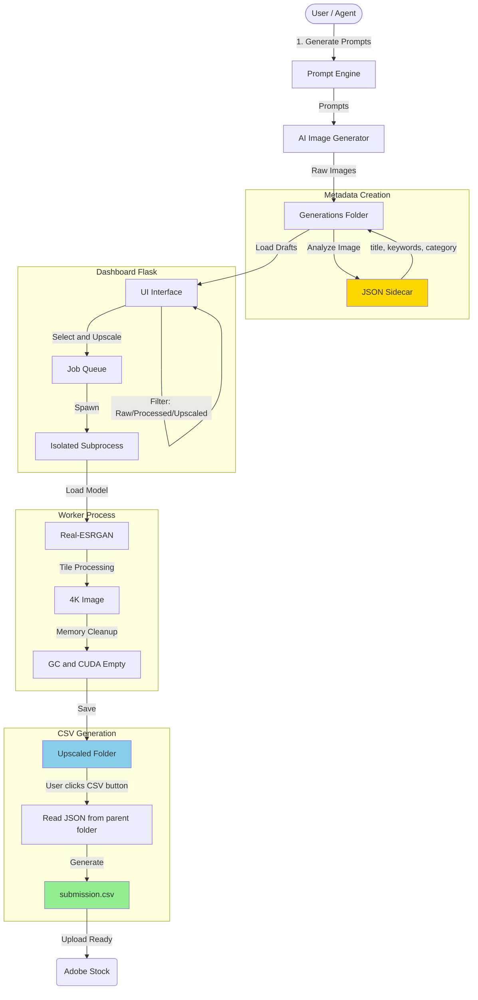
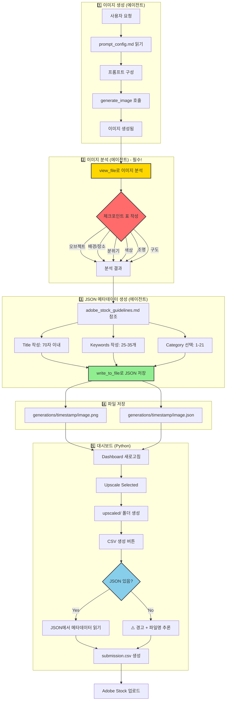

# Adobe Stock Generator

AI-powered image generation pipeline for Adobe Stock submissions with drag-and-drop dashboard management.

> ℹ️ **Note:** This project is designed to operate as a core module within the **Google Antigravity** agentic workflow, enabling seamless automation from prompt generation to final submission.

## 🎯 Overview

This project automates the Adobe Stock image submission workflow:
1. **Generate Prompts** → Create optimized prompts for AI image generation
2. **Process Images** → Crop to 16:9 and upscale to 4K with Real-ESRGAN
3. **Review & Select** → Drag-and-drop dashboard for image curation
4. **Submit** → Generate Adobe Stock compliant CSV metadata

---

## 📁 Project Structure

```
adobe-stock-generator/
├── dashboard/
│   ├── app.py                  # Flask web dashboard & API
│   └── templates/
│       └── index.html          # Drag-and-drop dashboard UI
├── config/
│   ├── prompt_config.md        # 📝 Editable prompt configuration
│   └── adobe_stock_guidelines.md # 📚 Metadata best practices & rules
├── visual_schema.py            # Visual attribute enums
├── prompt_engine.py            # Prompt construction logic
├── generate_prompts.py         # Prompt generation script
├── generation_pipeline.py      # Image processing (crop + upscale)
├── metadata_generator.py       # Adobe Stock metadata generator
├── models.py                   # Real-ESRGAN model definitions
├── weights/                    # Model weights (auto-downloaded)
├── generations/                # Output folder (timestamped)
│   └── {timestamp}/
│       ├── *.png               # Raw generated images
│       ├── *.json              # JSON metadata (sidecar)
│       ├── processed/          # 16:9 cropped images
│       └── upscaled/           # 4K images + submission.csv
├── submissions/                # (Legacy) Old submission packages
├── trash/                      # Deleted images
├── logs/                       # Processing logs
└── start_dashboard.bat         # Windows launcher
```

---

## 🚀 Quick Start

### 1. Generate Prompts
```bash
python generate_prompts.py
```
Creates `generations/{timestamp}/` folder with prompts.

### 2. Add Images
Copy AI-generated images to the `generations/{timestamp}/` folder.

### 3. Launch Dashboard
```bash
start_dashboard.bat
# or
cd dashboard && python app.py
```
Opens http://127.0.0.1:5001

### 4. Dashboard Workflow

| Action | Method |
|--------|--------|
| **Filter Images** | Use filter dropdown: All / Raw / Processed / Upscaled |
| **Select for Upscale** | Drag image → Right panel (Selection) |
| **Delete Image** | Drag image → Left panel (Trash) |
| **Upscale Selected** | Click "⚡ Upscale Selected" |
| **Generate CSV** | Select upscaled images → Click "📦 CSV 생성" |
| **Upload to Adobe** | Open `upscaled/` folder → Upload `submission.csv` + images |

---

## 🎨 Prompt Configuration

Edit `config/prompt_config.md` to customize prompts. Changes are reflected automatically.

### Configurable Elements:
- **Trends**: Cyberpunk, Minimalist Zen, Fantastic Frontiers, etc.
- **Styles**: Photorealistic, 3D Render, Cinematic, etc.
- **Lighting**: Natural, Neon, Golden Hour, etc.
- **Composition**: Rule of Thirds, Symmetrical, etc.
- **Color Palettes**: Vibrant Neon, Pastel, Earth Tones, etc.
- **Negative Prompts**: IP avoidance, quality control, content policy

---

## 📊 Core Modules

| Module | Purpose |
|--------|---------|
| `visual_schema.py` | Defines visual attributes (Trend, Style, Lighting, etc.) |
| `prompt_engine.py` | Constructs detailed prompts from attributes |
| `generate_prompts.py` | Generates sample prompts with MECE coverage |
| `generation_pipeline.py` | Image processing (16:9 crop → 4x upscale) |
| `metadata_generator.py` | Adobe Stock compliant metadata & CSV |
| `dashboard/app.py` | Flask API for image management |

---

---
## 🏗️ System Architecture



## 🔧 Key Technical Decisions & Optimizations

This project implements several advanced patterns to ensure stability and performance in a resource-intensive AI pipeline.

### 1. Process Isolation for Stability (Crash Resilience)
- **Challenge:** Upscaling 4K images consumes significant VRAM. If an OOM (Out of Memory) error occurs in a thread, it crashes the entire Flask web server.
- **Solution:** Integrated a **Subprocess Architecture**. The upscaling pipeline runs in a completely isolated process (`subprocess.Popen`).
- **Benefit:** If the GPU worker crashes, the dashboard remains alive, catches the exit code, and reports the error without downtime.

### 2. Memory Leak Prevention
- **Challenge:** PyTorch models and CUDA buffers often linger in VRAM, causing progressive memory buildup when processing batches of images.
- **Solution:** Implemented a **"Load-Execute-Unload"** pattern per image:
  - Explicitly `del` model and image tensors after each iteration.
  - Force `gc.collect()` and `torch.cuda.empty_cache()` to reclaim memory.
  - Reduced Real-ESRGAN tile size to **384px** to balance VRAM usage (6GB safe zone) vs. inference speed.

### 3. Real-time Log Streaming & Deadlock Prevention
- **Challenge:** Python's stdout buffering caused log delays, and unread pipes led to process deadlocks.
- **Solution:** 
  - Forced `sys.stdout.reconfigure(encoding='utf-8')` and `flush=True` in the worker.
  - Implemented a non-blocking pipe reader in the dashboard to drain stdout in real-time.
  - Dashboard UI polls an aggregated log system for live feedback.

### 4. Compatibility Patches
- **Challenge:** `basicsr` library (dependency of Real-ESRGAN) is incompatible with newer `torchvision` versions due to removed modules.
- **Solution:** Injected a runtime **Monkey Patch** to polyfill `torchvision.transforms.functional_tensor`, ensuring compatibility with the latest PyTorch ecosystem without downgrading packages.

---

---

## 📊 Logging & Debugging

로그 파일은 `logs/` 폴더에 저장되며, 문제 해결 및 퍼포먼스 분석에 활용합니다.

### Log Files:

| File | Purpose |
|------|---------|
| `logs/upscale.log` | 업스케일링 진행 상황, 시간 측정 |
| `logs/error.log` | 에러 스택트레이스, 크래시 원인 분석 |

### When to Check Logs:

1. **업스케일링 실패 시**: `error.log`에서 에러 원인 확인
2. **속도 저하 시**: `upscale.log`에서 이미지당 처리 시간 분석
3. **메모리 문제 시**: 타일 크기 조정 필요 여부 판단

### Performance Tuning:

`generation_pipeline.py`의 `TILE_SIZE` 상수 조정:
```python
# 512: 빠름, VRAM 많이 사용 (8GB+ 필요)
# 384: 균형, VRAM 중간 (~6GB) - 권장
# 256: 느림 (~50% 증가), VRAM 적게 사용 (~4GB)
TILE_SIZE = 384
```

### Clearing Logs:
- 대시보드 UI에서 "Clear Logs" 버튼 사용
- 또는 `logs/upscale.log`, `logs/error.log` 직접 삭제

---

## 🛠️ Requirements

```
Python 3.10+
Flask
Pillow
OpenCV (cv2)
PyTorch
realesrgan
```

### Install:
```bash
pip install flask pillow opencv-python torch realesrgan
```

---

## 📝 Changelog

- **v1.0**: Initial release with prompt generation
- **v1.1**: Added Real-ESRGAN upscaling pipeline
- **v1.2**: Dashboard with drag-and-drop image management
- **v1.3**: Configurable prompts via MD file
- **v1.4**: 
  - 🔧 Fixed torchvision 0.16+ compatibility (monkey patch)
  - 🔧 Fixed memory leak during upscaling (`del` + `torch.cuda.empty_cache()`)
  - ✨ Upscale progress display: `[m/n]` format
  - ✨ "모두 완료!" completion message
  - ✨ Auto-open upscaled folder on completion
  - ✨ Log Clear button in dashboard
  - 🚀 Auto-generate submission package after upscale
- **v1.5**: JSON Sidecar Metadata System
  - ✨ **새 모듈:** `prompt_metadata.py` - 프롬프트에서 메타데이터 자동 추출
  - ✨ **JSON 사이드카:** 이미지마다 `.json` 메타데이터 파일 생성
  - 🔧 **CSV 개선:** JSON 파일 우선 로드, 없으면 파일명에서 추론
  - 📚 **지식 베이스:** `config/adobe_stock_guidelines.md` 가이드라인 문서
  - 🔧 **메타데이터 품질:** 제네릭 템플릿 제거, 파일명 기반 제목 생성
  - ✅ **22개 카테고리:** Adobe Stock 전체 카테고리 지원
- **v1.6**: Stability & Memory Optimization - 🚀 **Subprocess Isolation:** Upscaling runs in a separate process, preventing dashboard crashes - 🔧 **Memory Optimization:** Model load/unload per image, aggressive `gc.collect()` - ⚙️ **Tile Size:** Reduced to 384 (Lower VRAM usage) - 📊 **Error Logging:** Separate `logs/error.log` with stack traces
- **v1.7**: UI/UX & Monitoring Improvements
  - 🎨 **UI Cleanup:** Selection panel action buttons moved to header (consistent layout)
  - ⏱️ **Real-time Monitoring:** Upscale progress and errors shown in dashboard logs instantly
  - 🔧 **Pipe Fix:** Resolved partial logs by flushing stdout and draining pipes
  - 🔧 **Compatibility:** Fixed `torchvision` import error in isolated subprocess
- **v1.8**: CSV Simplification & Metadata Flow Fix
  - 🔧 **CSV 직접 생성:** `upscaled/` 폴더에 `submission.csv` 직접 생성 (별도 submissions 폴더 불필요)
  - 🔧 **JSON 복사 버그 수정:** 업스케일 시 JSON 메타데이터 파일을 `upscaled/` 폴더로 자동 복사
  - 🔧 **JSON 읽기 버그 수정:** `list_images()` API에서 `image_dir` 파라미터 누락 문제 해결
  - ⚠️ **JSON 누락 경고:** CSV 생성 시 JSON 없는 이미지에 대해 콘솔 경고 출력
  - 📊 **has_json 플래그:** 이미지 목록 API에서 JSON 메타데이터 존재 여부 표시
- **v1.81**: UI Filter Dropdown
  - 🎨 **필터 드롭다운:** Drafts 영역에 필터 추가 (All / Raw Only / Processed / Upscaled)
  - 🚀 **Upscaled 필터:** 업스케일된 이미지만 빠르게 선택 가능
- **v1.82**: CSV Generation Improvements
  - 🔧 **업스케일 자동 CSV 제거:** 업스케일 완료 시 자동 CSV 생성 제거 (수동 버튼으로 제어)
  - 📁 **JSON 경로 개선:** CSV 생성 시 상위 폴더 (generation root)에서 JSON 탐색
  - 🔧 **UTF-8 BOM 지원:** PowerShell에서 생성한 JSON 파일 (BOM 포함) 정상 읽기
  - 📊 **디버깅 로그:** CSV 생성 시 JSON 탐색 경로 콘솔 출력
- **v1.83**: Workflow Documentation & Metadata Improvements
  - 🤖 **워크플로우 강화:** 에이전트가 `view_file`로 이미지를 직접 분석 후 JSON 생성 (필수)
  - ⛔ **체크포인트 추가:** 이미지 분석 단계에 필수 체크리스트 표 추가 (건너뛰기 방지)
  - 📊 **키워드 확장:** 권장 키워드 개수 25-35개로 상향 조정
  - 🔧 **자동화 코드 제거:** Python 기반 AI 자동 재생성 로직 제거 (에이전트 직접 수행으로 전환)
  - 📚 **키워드 사전 확장:** Subject, Style, Lighting, Color 사전 각 30개 이상으로 확장 (폴백 품질 개선)
  - ⚠️ **누락 경고 강화:** JSON 누락 시 콘솔 경고 + CSV 생성 결과에 개수 표시

---

## 🤖 How to Generate Images (AI Prompt Guide)

To generate initial images using an AI model (like Midjourney or DALL-E) that are compatible with this pipeline:

### Recommended Prompt Structure
Use the generated prompts from `generate_prompts.py`, or follow this structure:

> **[Subject]**, **[Style/Trend]**, **[Lighting]**, **[Composition]**, **[Color Palette]** --ar 16:9 --v 6.0

### Antigravity Workflow Example
When asking Antigravity to generate images, check `config/prompt_config.md` or `generations/` folder for context.

**Example Request to Antigravity:**
> "Please generate 5 images for the 'Cozy Christmas' trend using the `prompt_engine.py` logic. Save them directly to `generations/{timestamp}/` folder. Ensure they are 16:9 aspect ratio."

**Expected Output:**
- Antigravity creates a folder: `generations/2025-12-13_10-00-00/`
- Saves images: `image_01.png`, `image_02.png`... (raw size)
- Saves JSON sidecars: `image_01.json` (metadata)

Once images are in the folder, simply **refresh the Dashboard** to see them in "Drafts" and start the upscale process.

---

## 🔄 Complete Workflow: Image → JSON → CSV

이 프로젝트의 핵심 워크플로우입니다. 에이전트(Antigravity)가 이미지 생성부터 메타데이터 생성까지 모든 과정을 수행합니다.

### 프로세스 플로우차트



### 에이전트 수행 단계 상세

| 단계 | 도구 | 설명 |
|------|------|------|
| 1. 프롬프트 구성 | `view_file` | `config/prompt_config.md`에서 스타일, 품질 부스터 확인 |
| 2. 이미지 생성 | `generate_image` | AI 이미지 생성기 호출 |
| 3. 이미지 분석 | `view_file` | **생성된 이미지를 직접 보고 시각적 요소 추출** |
| 4. JSON 생성 | `write_to_file` | 분석 결과 기반 메타데이터 파일 생성 |
| 5. 파일 이동 | `run_command` | `generations/{timestamp}/` 폴더로 정리 |

### 체크포인트 표 (4단계 필수)

에이전트는 이미지 분석 시 반드시 아래 표를 채워야 합니다:

| 항목 | 분석 결과 |
|------|----------|
| 오브젝트 | 이미지에 보이는 주요 물체/인물 |
| 배경/장소 | 실내/실외, 구체적 장소 |
| 분위기 | 감정, 느낌, 톤 |
| 색상 | 지배적 색상, 색상 조화 |
| 조명 | 자연광/인공광, 방향, 강도 |
| 구도 | 앵글, 프레이밍, 구성 |

### JSON 메타데이터 형식

```json
{
  "filename": "cozy_christmas_living_room.png",
  "title": "Cozy living room with Christmas tree and glowing fireplace",
  "keywords": [
    "christmas", "living room", "fireplace", "tree", "cozy",
    "holiday", "decoration", "warm", "winter", "home",
    "interior", "festive", "celebration", "light", "ornament",
    "family", "tradition", "december", "gift", "present",
    "comfort", "evening", "indoor", "domestic", "seasonal"
  ],
  "category": "15",
  "category_name": "Culture and Religion",
  "asset_type": "photo",
  "prompt": "Professional stock photo, cozy Christmas living room...",
  "is_ai_generated": true,
  "is_fictional": true
}
```

### CSV 생성 로직 (Python)

`dashboard/app.py`의 `get_metadata_for_file()` 함수:

1. **JSON 우선:** `{image_name}.json` 파일 존재 확인 → 있으면 읽어서 사용
2. **폴백:** JSON 없으면 경고 로그 출력 + `metadata_generator.py`로 파일명 기반 추론
3. **결과 표시:** CSV 생성 시 JSON 누락 개수 집계 후 사용자에게 ⚠️ 메시지 표시

---

## 📋 워크플로우 파일 위치

| 파일 | 용도 |
|------|------|
| `.agent/workflows/generate-stock-image.md` | 에이전트 실행 워크플로우 (7단계) |
| `config/prompt_config.md` | 프롬프트 구성 요소 |
| `config/adobe_stock_guidelines.md` | Adobe Stock 메타데이터 규칙 |

