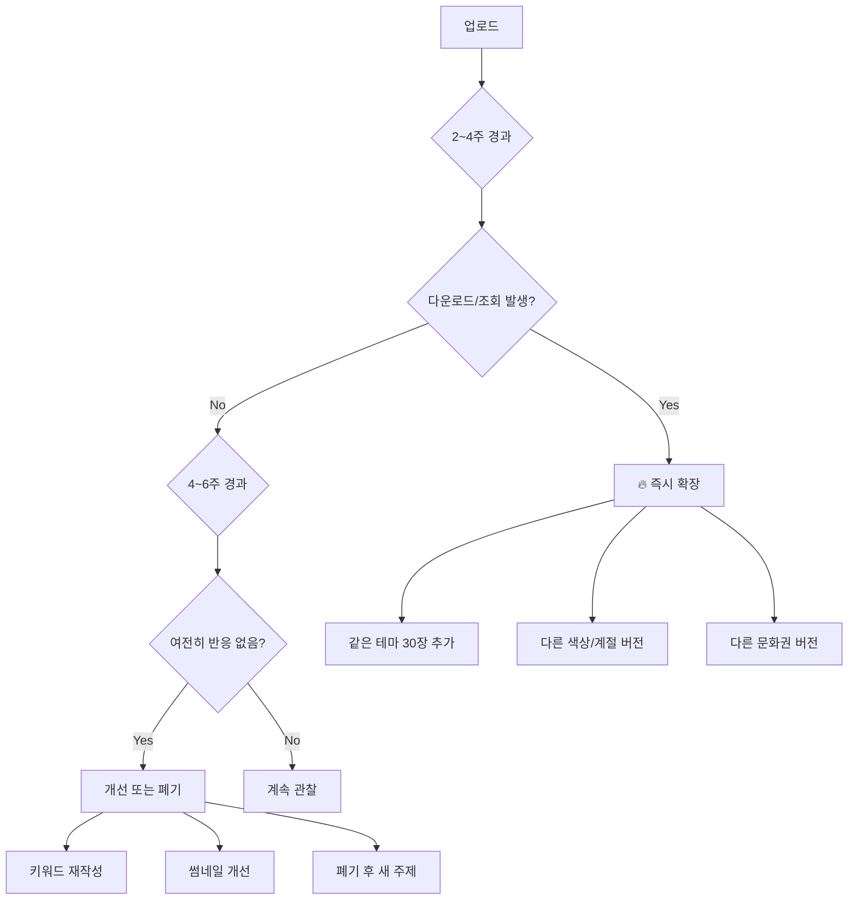

# Adobe Stock 전략 가이드라인 (멱법칙 기반)

> **핵심 철학**: "대부분의 수익은 소수의 '대박 에셋'에서 나오고, 나머지는 긴 꼬리(long tail)로 잔잔하게 들어온다."
> 
> 따라서 전략은 **"평균을 올리는 노동"보다 "대박 확률 × 대박 크기"를 키우는 방향**으로 설계한다.

---

## 🎯 전략 원칙 요약

| 원칙 | 실행 방법 |
|------|----------|
| **시도 횟수 극대화** | 시리즈/변주로 10~50장 단위 묶음 생산 |
| **대박 확률 증가** | 에버그린 + 시즌성 + 트렌드 바벨 전략 |
| **대박 크기 키우기** | 활용 가능성 높은 재료형 에셋 (여백, 세트, 키트) |
| **검색 노출 최적화** | 메타데이터를 "공학적"으로 설계 |
| **승자에게 집중 투자** | 반응 오는 에셋 → 즉시 변주 확장 |

---

## 1️⃣ 시도 횟수(샷 수)를 시스템으로 늘려라

멱법칙 세계에선 한 방이 게임을 바꾸고, 한 방은 보통 "많은 시도"에서 나온다.

### 실행 지침:
- **한 장 완벽주의 금지**: 구도, 색상, 텍스트 여백, 비율, 피사체만 살짝 바꿔서 10~50장 변주
- **업로드 분산**: 일시 몰빵보다 주기적 업로드 (알고리즘/노출 유리)
- **파이프라인 템플릿화**: 프롬프트 → 스타일 → 후처리 → 메타데이터까지 "공정"으로

### 자동화 연계:
```yaml
batch_generation:
  min_per_theme: 10
  max_per_theme: 50
  variation_axes:
    - color_palette  # Warm, Cool, Neutral
    - composition    # Centered, Rule of Thirds, Negative Space
    - aspect_ratio   # 16:9, 1:1, 9:16
    - copy_space     # With text area, Without text area
```

---

## 2️⃣ 대박 확률을 올리는 주제 선택: 바벨 전략

한 가지만 하지 말고, **리스크 분산 + 대박 확률**을 동시에 잡는다.

### 포트폴리오 비율 (권장):

| 유형 | 비율 | 특징 | 예시 |
|------|------|------|------|
| **에버그린** | 60% | 기본 수요, 안정적 | 비즈니스, 라이프스타일, 배경/텍스처, UI목업, 교육, 의료 |
| **시즌성** | 30% | 예측 가능한 피크 | 크리스마스, 설/추석, 졸업, 여름휴가, 할로윈, 블랙프라이데이 |
| **트렌드** | 10% | 고분산 베팅 | 뜨는 미학/테마 빠른 변주 (성공시 크게, 실패도 잦음) |

### 시즌성 캘린더 (업로드 타이밍):

> ⚠️ **중요**: 시즌 에셋은 **피크 2~3개월 전**에 업로드 필요!

| 시즌 | 피크 시기 | 업로드 시작 |
|------|----------|------------|
| 크리스마스 | 12월 | **9~10월** ✅ |
| 발렌타인 | 2월 14일 | 12월 |
| 설날/춘절 | 1~2월 | 11월 |
| 부활절 | 3~4월 | 1월 |
| 여름휴가 | 6~8월 | 4월 |
| 할로윈 | 10월 31일 | 8월 |
| 블랙프라이데이 | 11월 말 | 9월 |
| 추수감사절 | 11월 | 9월 |

---

## 3️⃣ 대박 크기를 키우는 방법: '활용 가능성'을 팔아라

스톡에서 수익이 큰 것들은 보통 **"여러 곳에 쓸 수 있는 재료"**다.

### 활용성 높은 에셋 유형:

#### A. 카피 공간(Copy Space) 버전
```yaml
copy_space_variants:
  - left_aligned    # 왼쪽에 텍스트 공간
  - right_aligned   # 오른쪽에 텍스트 공간
  - top_banner      # 상단 배너 공간
  - centered_hero   # 중앙 히어로 공간
```

#### B. 비율 세트 (3종 세트)
| 용도 | 비율 | 활용처 |
|------|------|--------|
| 배너 | 16:9 / 21:9 | 웹사이트 헤더, YouTube 썸네일 |
| 포스터 | 9:16 / 2:3 | 인스타 스토리, 포스터 |
| 정사각 | 1:1 | SNS 피드, 앱 아이콘 |

#### C. 캠페인 키트
```yaml
campaign_kit:
  backgrounds: 10    # 통일된 톤의 배경 10장
  objects: 10        # 잘라쓸 수 있는 오브젝트 10장
  patterns: 10       # 타일러블 패턴 10장
  # → 브랜드 일관성 → 재구매 발생
```

---

## 4️⃣ 검색/발견은 확률게임의 조준장치: 메타데이터 공학

멱법칙에서 대박은 랜덤처럼 보여도, **노출 표면적이 크면 확률이 올라간다**.

### 제목 작성 규칙:
- ❌ "Professional", "Commercial", "High Quality"로 시작 금지
- ✅ 이미지에 보이는 것을 **자연스러운 문장**으로 설명
- ✅ 사람이 실제로 검색할 만한 표현 사용

```
# Good
"Cozy living room with Christmas tree and glowing fireplace"
"Business team discussing strategy in modern glass office"

# Bad  
"Professional Christmas Holiday Season Commercial Stock Image"
```

### 키워드 작성 규칙:

```yaml
keyword_structure:
  tier_1:  # 1~10번 (최고 가중치)
    - 핵심 오브젝트 (christmas tree, fireplace)
    - 핵심 분위기 (cozy, warm)
    - 핵심 시즌 (christmas, winter, holiday)
    
  tier_2:  # 11~25번 (중간 가중치)
    - 장소/배경 (living room, interior, home)
    - 색상/조명 (golden light, soft glow)
    - 스타일 (modern, traditional)
    
  tier_3:  # 26~35번 (롱테일)
    - 용도 (banner, background, greeting card)
    - 감정 (celebration, family, tradition)
    - 관련 개념 (december, evening, indoor)
```

### 같은 이미지, 다른 타겟:
> 비슷한 이미지라도 **키워드 타겟을 다르게** 해서 다른 검색어 풀 공략

| 버전 | 타겟 키워드 |
|------|------------|
| 배경용 | background, wallpaper, texture, backdrop |
| 포스터용 | poster, banner, header, copy space |
| 브랜딩용 | branding, marketing, advertising, commercial |

---

## 5️⃣ 수익 데이터로 "승자에게만 추가 투자"

> **멱법칙의 정석**: 반응 없으면 버리고, 반응 오면 몰아준다.

### 의사결정 프레임워크:



### 클러스터 효과:
> "한 장이 벌기 시작하면 비슷한 것들이 같이 번다"

반응 오는 에셋 발견 시:
1. 같은 테마로 **30장 이상** 추가 생산
2. 색상 변주 (Warm → Cool → Neutral)
3. 계절 변주 (Winter → Spring → Summer)
4. 문화권 변주 (Western → Asian → Universal)

---

## 6️⃣ 리스크 관리

멱법칙 구조에서는 **수익이 불규칙**해서 멘탈 관리가 중요하다.

### 목표 설정 원칙:
```yaml
# ❌ 결과 기반 목표 (통제 불가)
bad_goals:
  - "이번 달 수익 $100"
  - "다운로드 500회"

# ✅ 행동 기반 목표 (통제 가능)  
good_goals:
  - "이번 달 업로드 100장"
  - "주간 3개 테마 실험"
  - "매주 1개 시즌 에셋 시리즈"
```

### 저작권 리스크 (절대 보수적으로):

> ⛔ **대박 한 번에 계정 전체를 날릴 수 있는 위험 요소**

| 위험 요소 | 대응 |
|----------|------|
| 유명 캐릭터 닮은꼴 | 완전히 다른 디자인으로 |
| 브랜드 로고 | 절대 포함 금지, 모호해도 제외 |
| 특정 인물 닮은꼴 | AI 생성임에도 주의 필요 |
| 상표/특허 디자인 | 제네릭 디자인으로 대체 |
| 유명 건축물 | 상업적 사진은 주의 |

---

## 📊 월간 체크리스트

### 생산 (시도 횟수)
- [ ] 월 최소 **50장** 이상 업로드
- [ ] **시리즈 단위**(10~50장)로 묶어서 생산
- [ ] 업로드 **분산** (주 2~3회)

### 포트폴리오 (주제 배분)
- [ ] 에버그린 60% 유지
- [ ] 다음 시즌 에셋 미리 준비 (2~3개월 전)
- [ ] 트렌드 베팅 10% 내외

### 분석 (승자 투자)
- [ ] 2~4주 된 에셋 성과 체크
- [ ] 반응 오는 에셋 → 변주 확장 계획
- [ ] 반응 없는 에셋 → 개선 or 폐기

### 리스크
- [ ] 저작권 위험 요소 점검
- [ ] 업로드 전 로고/브랜드 이중 체크

---

## 🔗 관련 파일

| 파일 | 용도 |
|------|------|
| `prompt_config.md` | 프롬프트 스타일/트렌드 설정 |
| `adobe_stock_guidelines.md` | 메타데이터 규칙 |
| `generate-stock-image.md` | 에이전트 실행 워크플로우 |

---

*Last Updated: 2024-12-14*
